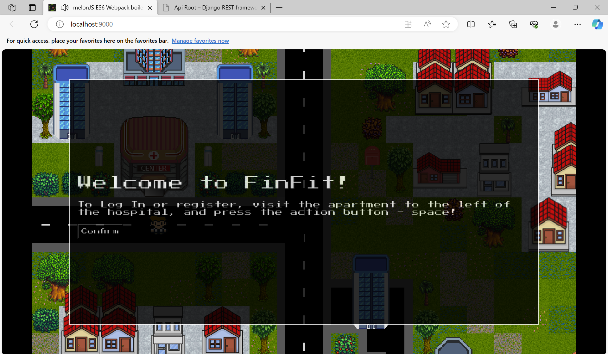
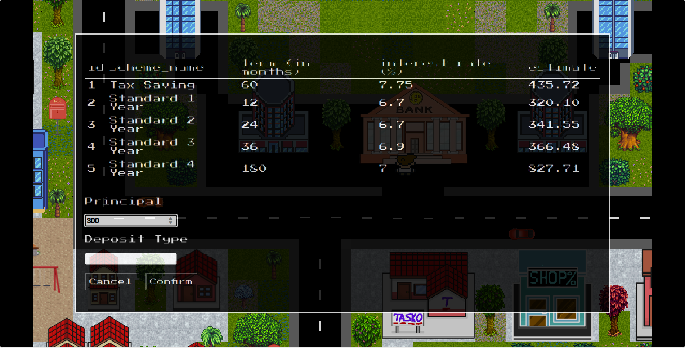
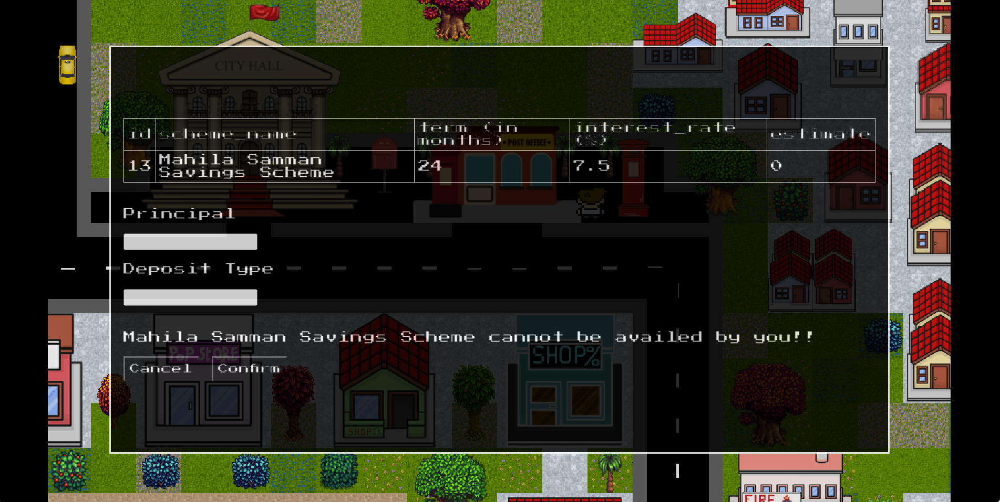

# FinFit

## Introduction
Welcome to FinFit, your comprehensive financial education platform. FinFit is designed to equip users with the knowledge and skills needed to navigate the complex world of personal finance effectively. This README provides an overview of the app's features, how to get started, and how to make the most of FinFit's financial education experience.

## Features
FinFit offers a range of features to enhance your financial literacy:

**Investment Options**: Explore major avenues including Bank & Post Office Deposit Schemes, Real Estate, and Commodities to understand your investment choices.

**Smart Budgeting**: Plan your expenditures based on your monthly income and create a financial safety net for emergencies.

**Personalization**: Schemes available to you will be customized according to real-world criteria like geographical location, age, and gender.

**Frauds & Scams**: Learn to identify and safeguard against financial scams by navigating realistic scenarios in the app.

## Images

### Town Map 

### Landing Page

### User Information

### Bank

### Post Office Schemes

### Randomized Emergency Alert

### Potential Fraud/Scam

## Setup and Installation

To run FinFit locally, follow these steps:

1. Clone the repository to your local machine.

2. Install the required python dependencies by running `pip install -r requirements.txt` in the backend folder.

3. Navigate to the backend folder and run `python manage.py runserver`.

4. Navigate to the frontend folder and run `npm run dev`.

5. Access the gane on your local server (e.g., http://localhost:9000).